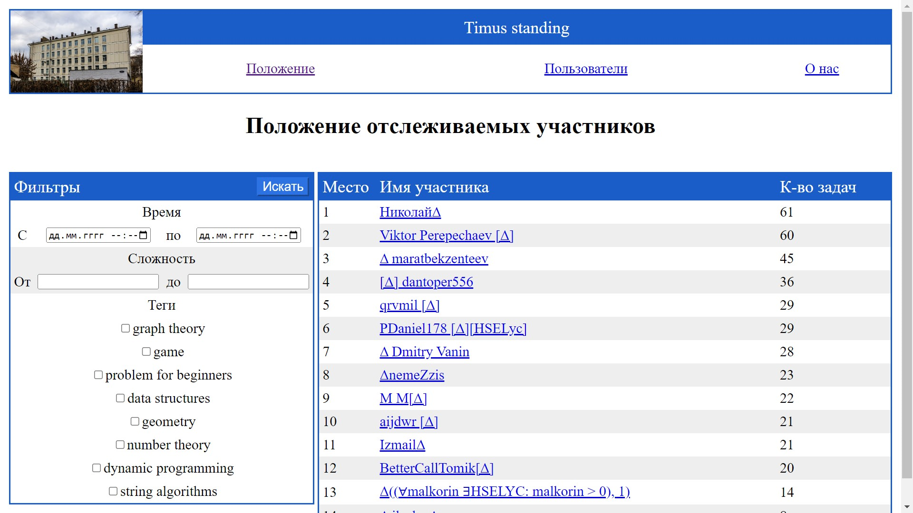

# Timus standing

Timus standing is a web application for parsing data from 
[Timus](https://acm.timus.ru/) (a problem archive similar to LeetCode,
widespread in CIS countries) developed in May 2023. Its tech stack consists of
the web framework [Flask](https://flask.palletsprojects.com/) and the web
scraping library [beautifulsoup4](https://pypi.org/project/beautifulsoup4/).
Its main goal is to make hosting problem-solving competitions on Timus easier.
It achieves this by gathering information about participants
added to the database, allowing it to be filtered by problem tags, 
difficulty and time of solving.

## Running on a development server

* Clone this GitHub repository
* Install needed dependencies as listed in 
[requirements.txt](requirements.txt)
* Run [main.py](main.py)

## Features

* Managing the participants: adding them by name or name template 
or deleting them
* Modifying the set of problems that count for the competition
by filtering them by problem class tags, difficulty level
and time of attempt submission
* Arranging all participants in a ranking table

## Project structure

* [data](data) contains table descriptions for the database model.
* [db](db) contains the database file.
* [static](static) consists of several subfolders:
  * [css](static/css) contains the project's stylesheet.
  * [img](static/img) contains an image of the HSE Lyceum 
  used in pages' header.
* [templates](templates) contains Jinja templates for the site's pages.
* [coroutines.py](coroutines.py) contains code for the database updating
that needs to be executed regularly, parallel to the main code (hence
the name).
* [main.py](main.py) contains the application logic for all the endpoints.
* [requirements.txt](requirements.txt) lists all the dependencies.
* [routines.py](routines.py) contains functions for updating the database.
* [timus_parser.py](timus_parser.py) contains web scraping functionality.
* [wsgi.py](wsgi.py) was used for production deployment along with
the [Dockerfile](Dockerfile)
